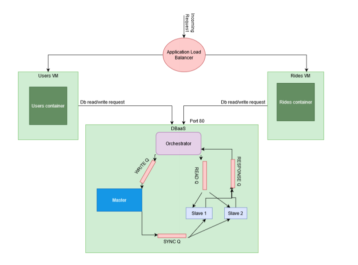

# Rideshare

  

RideShare is a Ride Pooling application to enable people share rides (like UberGo).

This project provides the backend support as a fault tolerant, highly available database as a service for the RideShare application. 

### Technologies used
- Docker
- REST APIs
- AWS EC2 
- Application Load Balancer
- RDBMS with Sqlite
- Zookeeper
- RabbitMQ
- Flask for development
- Nginx with Gunicorn for deployment on EC2 instances
- Orchestration
- Python3

## Design

This project follows a master-slave architecture with an orhestrator. An Application load balancer routes requests based on User or Ride specifics, to different AWS EC2 instances. The Master and Slaves communicate through a Messaging Service (RabbitMQ)

## Architecture of DBaaS

- The orchestrator is a Flask App that listens to incoming requests on port 80.
- `AMQP(Advanced Message Queue Protocol)` using `RabbitMQ` is used as the message broker
- The `Orchestrator` is responsible for publishing the incoming message into the relevant queue and bringing up new worker containers as desired.
- There are four message queues named “readQ”, “writeQ”, “syncQ” and “responseQ”   
- All the read requests are published to the readQ.  
- All the write requests are published to the writeQ.  
- There are two types of workers running on the instance, “master” worker and “slave” worker.  
- The master worker listens to the “writeQ”. It picks up all incoming messages on the “writeQ” and actually write them to a persistent database (SQLite).  
- The slave worker is responsible for responding to all the read requests coming to the DBaaS orchestrator.   
- The slave worker listens to the readQ, and picks up any messages on that queue.  
- Upon querying the database based on the request, the slave writes the output to the “responseQ”, which is then picked up by the orchestrator.  
- If there are multiple instances of the worker running, then the messages from the readQ are picked up by the slave workers in a round robin fashion.     
- Each worker (slave and master) will have its own copy of the database. The database is not shared among the workers.  
- Separate database creates the problem of maintaining consistency between the various replicas of the same database.    
    - To solve this issue, an “eventual consistency” model is used, where after a write has successfully been performed by the master worker, it is eventually be consistent with all the slave workers.   
    - For implementing `eventual consistency`, the master writes the new db writes on the “syncQ”. After every write that master does, it is picked up by the slaves to update their copy of the database to the latest.  
- All the workers run in their own Docker containers, but they connect to a common rabbitMQ.  
- The orchestrator also runs in a seperate container.  
  
 

## High Availability

DBaaS has to be highly available, hence all the workers are “watched” for failure by `Zookeeper`, a cluster coordination service.   
- If a master fails:  
    - A new master is elected amongst the existing slaves. The slave whose container has the lowest pid, is elected as the master.
    - A new slave worker is started and all the data is copied asynchronously to the new worker.      
- If a slave worker fails:  
    - A new slave worker is started.
    - All the data is copied to the new slave asynchronously

## Scalability

The orchestrator has keeps count of all the incoming HTTP requests for the db read APIs. I assume that most requests are read requests and hence the master worker does not need scaling out. 
The auto scale timer begins after receiving the first request.  
After every two minutes, depending on how many requests were received, the orchestrator increases/decreases the number of slave worker containers. The counter is reset every two minutes.  
For auto-scaling count only db read APIs.
0 – 20 requests – 1 slave container will be running
21 – 40 requests – 2 slave containers will bee running
41 – 60 requests – 3 slave containers will be running
And so on.

## APIs

APIs to handle create, join, delete, list rides and users, count requests etc, has been implemented using REST APIs.

## Instructions to run:

This repository reflects the 4 stage process I followed for creating the backend of Rideshare.
The specifications of each stage are available as PDF documents in the stage folders.

Stage 1: Build APIs

Stage 2: Dockerised APIs into 1 docker container 

Stage 3: Seperated Rides and Users database, APIs as seperate containers running on seperate Amazon EC2 instances connected via load balancer

Stage 4: Built a fault tolerant, highly available database as a service for the RideShare application. This DBaaS has High Availability and Scalability implemented with Zookeeper and RabbitMQ.

SSH into the following instances and clone this repository:
User instance IP: 54.82.244.44
Rides instance IP: 52.2.156.61
DBaaS instance IP: 52.203.199.62

To run the code after cloning:

1. Setup user service:  
`$cd cloud/stage4/assignment3/users`  
`$docker-compose up --build`

2. Setup user service:  
`$cd cloud/stage4/assignment3/rides`  
`$docker-compose up --build`  

3. Set up DBaaS:  
`$cd cloud/stage4/zook`  
`$docker-compose up --build --scale worker=3`  

Then send requests to the instances.
DONE!

### **EDIT**
The instances may no longer be running, but this project can be ported to any new instance with some minor changes to thr IP address routing within some files in the repository.
